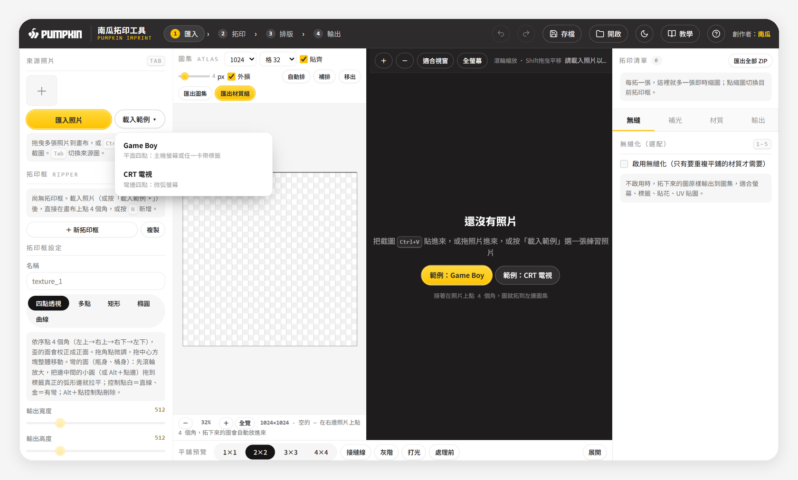
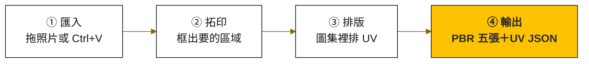
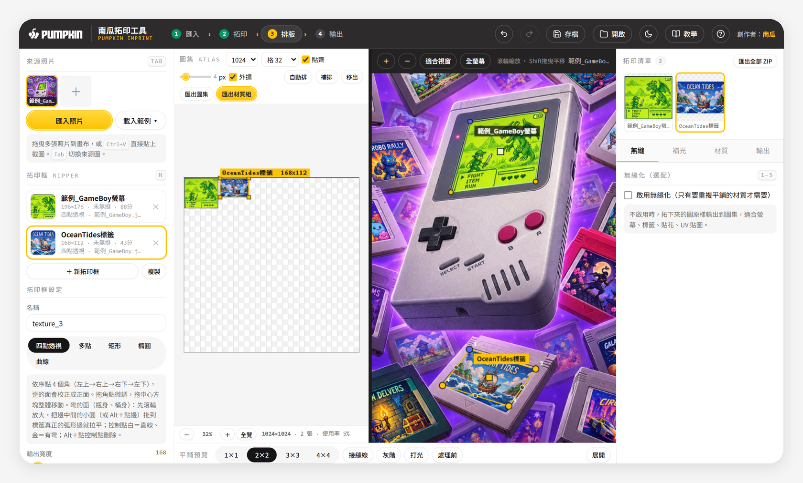
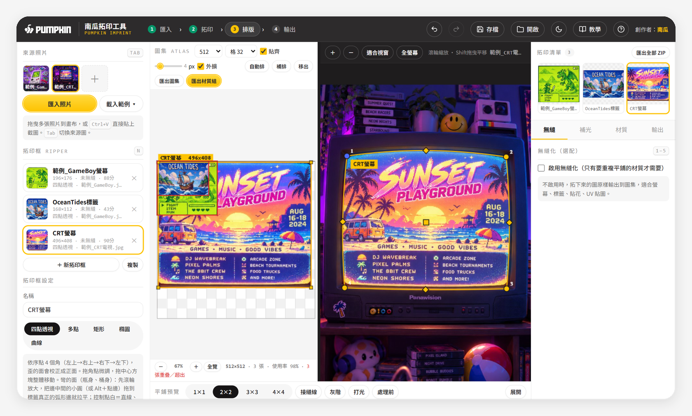
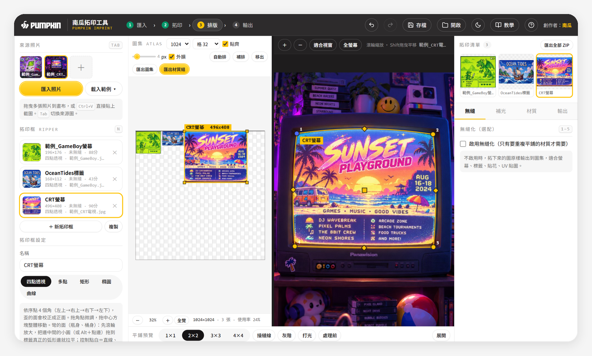
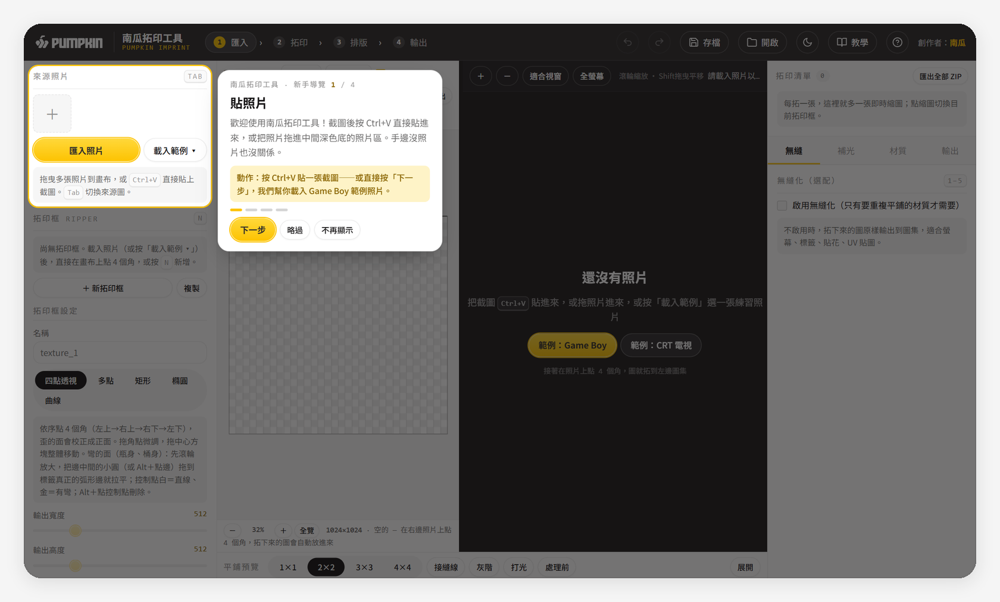
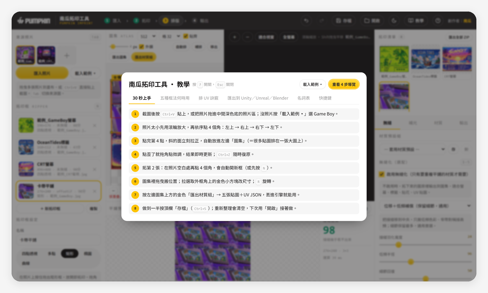
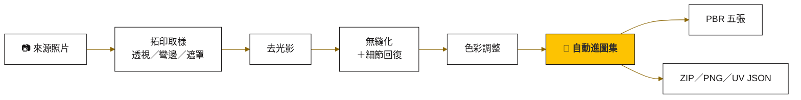

<picture>
  <source media="(prefers-color-scheme: dark)" srcset="docs/readme/banner-dark.svg">
  
</picture>

<h1 align="center">🎃 南瓜拓印工具 · Pumpkin Imprint</h1>

<p align="center"><b>把歪照片拓成正面貼圖，排好 UV，一鍵出五張 PBR</b><br>微微鼓起的 CRT 螢幕、瓶身、桶身標籤也能貼著弧線拓下來。單一 HTML、免安裝、可離線。</p>

<h2 align="center"><a href="https://terry12260201.github.io/pumpkin-imprint/">▶ 線上直接用（免安裝，打開就能拓）</a></h2>

<p align="center">
  <a href="https://terry12260201.github.io/pumpkin-imprint/"></a>
  
  
  
</p>

<p align="center">
  <a href="#-四個步驟">四個步驟</a> •
  <a href="#-範例圖game-boy-與-crt-電視">範例圖</a> •
  <a href="#-彎的面瓶身桶身標籤">彎的面</a> •
  <a href="#-第一次用內建教學">內建教學</a> •
  <a href="docs/教學.md">同事上手教學</a> •
  <a href="#-給接手的-ai">給接手的 AI</a>
</p>

做 3D 模型貼圖時，手邊常常只有一張照片：機器面板、木箱、瓶身標籤、一面牆。照片裡的東西是歪的、有透視、有光影，還得自己排 UV。

南瓜拓印工具把這整段收進一個網頁：**點四個角把歪的面拉正，拓下來自動排進圖集，再一鍵匯出 Albedo、Normal、Roughness、AO、Height 五張貼圖**，照 Unity、Unreal、Blender 的命名規則存好。看完這頁，你可以直接用線上版拓出第一張貼圖，或把它當成 skill 交給 AI 繼續改。

<p align="center">
  
  <br><sub>▲ 中間框照片、左邊排圖集、右上看每張拓印。範例圖：南瓜提供（AI 生成示意圖，無真實品牌）</sub>
</p>

<!-- 🎬 影片位：20–40 秒操作錄影（建議：載入範例 Game Boy → 點螢幕四角 → 換 CRT 拉彎邊 → 匯出材質組）。
     上架方式：在 GitHub 網頁編輯這個 README，把 mp4 拖進編輯框（≤ 10MB），
     會產生 https://github.com/user-attachments/assets/… 網址，單獨放一行取代這段註解。 -->

---

## 📌 目錄

- [它在做什麼](#-它在做什麼)
- [怎麼開始](#-怎麼開始)
- [範例圖：Game Boy 與 CRT 電視](#-範例圖game-boy-與-crt-電視)
- [四個步驟](#-四個步驟)
- [彎的面：CRT 螢幕、瓶身、桶身標籤](#-彎的面瓶身桶身標籤)
- [要平鋪的材質：無縫化](#-要平鋪的材質無縫化)
- [第一次用：內建教學](#-第一次用內建教學)
- [其他好用的](#-其他好用的)
- [快捷鍵](#-快捷鍵)
- [目前的限制](#-目前的限制)
- [自己用、自己改](#-自己用自己改)
- [給接手的 AI](#-給接手的-ai)
- [名詞對照表](#-名詞對照表)
- [更新紀錄](#-更新紀錄)

---

## 📸 它在做什麼

「拓印」就像拿紙蓋在石碑上拓字：不管原本的表面怎麼斜，拓下來都是正的。

<table>
  <tr>
    <td align="center" width="50%"><br><sub>拓印前：照片裡斜放、有透視的 Game Boy 螢幕</sub></td>
    <td align="center" width="50%"><br><sub>拓印後：點四個角拉成正面；勾「像素風」放大 4 倍也不糊</sub></td>
  </tr>
</table>

拉正之後的圖會自動放進左邊的圖集。你可以拖曳、縮放、旋轉，自己排 UV。排好就能整組匯出，直接貼到 3D 模型上。

| 你手上有 | 拓印給你 |
|---|---|
| 一張斜放的掌機、卡帶標籤照片 | 一張正面的螢幕／標籤貼圖，放在圖集裡 |
| 一台螢幕微微鼓起的 CRT 電視、瓶身標籤 | 貼著弧形邊拓下來的貼圖，邊緣不會被切掉 |
| 一片要重複鋪滿的材質（像滿桌卡帶） | 四邊接得起來的無縫材質，附接縫分數 |
| 一整張排好的圖集 | Albedo／Normal／Roughness／AO／Height 五張＋記錄每塊位置的 UV JSON |

---

## 🚀 怎麼開始

兩種用法，功能完全一樣：

| 用法 | 怎麼做 | 適合 |
|---|---|---|
| **線上版** | 打開 [terry12260201.github.io/pumpkin-imprint](https://terry12260201.github.io/pumpkin-imprint/) | 想馬上試、不想下載 |
| **離線版** | 下載這個 repo，雙擊根目錄的 `index.html` | 斷網環境、公司內網、想自己改 |

**做對的話**，頂欄 Logo 右邊會看到「**南瓜拓印工具**」，第一次打開會跳出「新手導覽」第 1 步，左上的「來源照片」區塊會亮起來。手邊沒照片，按「**載入範例 ▾**」選 Game Boy 或 CRT 電視就能練（見下一節）。

> [!TIP]
> 用 Chrome 或 Edge。照片解析度越高，拓出來越清楚；拍的時候盡量正面一點、光線平均一點。

---

## 🎮 範例圖：Game Boy 與 CRT 電視

工具內建兩張練習圖，不用自己找圖。左欄「**載入範例 ▾**」或空畫布中央的按鈕都能開：

| 範例 | 練什麼 | 怎麼練 |
|---|---|---|
| **Game Boy**（主機＋一堆虛構卡帶） | 平面四點 | 點主機綠色螢幕的 4 個角，或挑任何一片卡帶標籤（DRAGONVALE、OCEAN TIDES……）。新手導覽第 2 步會自動幫你點好螢幕 |
| **CRT 電視**（播著 SUNSET PLAYGROUND 海報，螢幕微微鼓起） | 彎邊四點 | 點螢幕 4 個角，再把四條邊中間的小圓拖到螢幕真正的弧形邊，見[彎的面](#-彎的面瓶身桶身標籤) |

<p align="center">
  
  <br><sub>▲ 空畫布中央兩顆範例按鈕，左欄「載入範例 ▾」也能選</sub>
</p>

**做對的話**，照片出現在中間照片區，左上「來源照片」多一張縮圖，下方提示「已載入範例」。

> [!NOTE]
> 範例圖：南瓜提供（AI 生成示意圖，無真實品牌）。以縮小後的 JPEG 內嵌在 `index.html` 裡，所以工具仍是單一檔案、離線可用。

---

## 🧭 四個步驟

工具最上方有一條流程列，照著走就不會迷路：



### ① 匯入

把照片拖進**中間深色底的照片區**，或截圖後直接按 <kbd>Ctrl</kbd> + <kbd>V</kbd> 貼上。可以一次放好幾張，用 <kbd>Tab</kbd> 切換。

**做對的話**，照片出現在中間，左上「來源照片」多一張縮圖。

### ② 拓印：五種框法

照片裡的東西如果很小，先用滾輪放大到它差不多佔滿照片區，點起來才準。

| 按鍵 | 模式 | 什麼時候用 |
|:---:|---|---|
| <kbd>Q</kbd> | **四點透視** | 歪的平面要拉正：依序點左上 → 右上 → 右下 → 左下。**彎的面**也用它，見[下一節](#-彎的面瓶身桶身標籤) |
| <kbd>P</kbd> | 多點 | 不規則形狀：沿著邊一點一點描，點回起點或按 <kbd>Enter</kbd> 收合，框外變透明 |
| <kbd>M</kbd> | 矩形 | 已經是正面的東西，快速框一塊 |
| <kbd>O</kbd> | 橢圓 | 圓形貼紙、徽章、錶面 |
| <kbd>C</kbd> | 曲線展平 | 圓柱：上緣點 3 點、下緣點 3 點，把弧面攤平 |

**做對的話**，框好的瞬間左邊圖集就出現拉正後的圖，右上「**拓印清單**」也多一張縮圖，不用按任何按鈕。點歪了就拖角點微調；拖的時候先用 ¼ 解析度預覽，放開才算全解析度，所以很順。

<p align="center">
  
  <br><sub>▲ 拓完立刻進圖集，右上拓印清單看得到每一張的結果，點縮圖就切換</sub>
</p>

要拓第 2 張，在照片空白處再點 4 個角，工具會自動開新框（或先按 <kbd>N</kbd>）。

### ③ 排版

左邊圖集就是你的 UV 版面。

| 想做什麼 | 怎麼做 |
|---|---|
| 搬位置 | 直接拖曳（貼齊格線） |
| 改大小 | 在圖集裡點那張圖，拉四角的金色小方塊（鎖比例；<kbd>Alt</kbd>＋拉＝自由比例）。放開會用新尺寸**重新拓**，不是單純放大，所以不會越拉越糊 |
| 旋轉 | <kbd>R</kbd> 轉 90° |
| 放大看細節 | 滾輪縮放、<kbd>Shift</kbd>＋拖曳或中鍵平移、<kbd>Home</kbd> 回全覽 |
| 一次排好 | 「自動排」 |

兩張重疊或超出圖集會標紅，匯出前清掉。

<p align="center">
  
  <br><sub>▲ v2.3 起圖集可以放大檢視，4096 的大圖集上小張貼圖也能精修</sub>
</p>

### ④ 輸出

打開右欄「**輸出**」分頁，先在「目標引擎」選 Unity／Unreal／Blender，檔名和法線方向會自動對好。

| 按鈕 | 得到什麼 |
|---|---|
| **匯出材質組**（金色） | 整張圖集的 Albedo／Normal／Roughness／AO／Height 五張＋UV JSON |
| 匯出圖集 | 只有顏色那張 |
| 匯出全部 ZIP | 每張拓印一個 PNG，打包成一個 ZIP，檔名＝`來源檔名_拓印名.png` |
| 匯出貼圖 PNG／<kbd>Ctrl</kbd> + <kbd>E</kbd> | 目前選的那一張 |

<p align="center">
  
</p>

| 引擎 | 檔名範例 | 匯進去後要做的事 |
|---|---|---|
| 通用 | `name_albedo`、`name_normal`… | — |
| Unity | `_BaseColor`、`_Normal`、`_Roughness`、`_AO`、`_Height` | 點 `_Normal` → Texture Type 改 **Normal map** → Apply |
| Unreal | `T_name_D`、`_N`、`_R`、`_AO`、`_H` | `_R`、`_AO` 取消 **sRGB**；Normal 已自動是 DirectX 方向 |
| Blender | `_col`、`_nor`、`_rough`、`_ao`、`_disp` | `_nor` 的 Color Space 選 **Non-Color**，接 Normal Map 節點 |

> [!IMPORTANT]
> 工具不會自動暫存。重新整理或關掉分頁，內容就不見了。做到一半記得 <kbd>Ctrl</kbd> + <kbd>S</kbd> 存成專案 JSON，下次 <kbd>Ctrl</kbd> + <kbd>O</kbd> 打開接著做。

---

## 🥫 彎的面：瓶身、桶身標籤

v2.3 最大的新功能，用範例「**CRT 電視**」練最清楚。一般四點框的邊是直的，拿來拓微微鼓起的 CRT 螢幕，框線會切進弧形邊裡面，螢幕邊緣一圈被吃掉：

<table>
  <tr>
    <td align="center" width="50%"><br><sub>直的四點框：框線切進弧形邊</sub></td>
    <td align="center" width="50%"><br><sub>四條邊各拉一個控制點：貼著弧形邊</sub></td>
  </tr>
</table>

做法：

1. **先用滾輪把螢幕放大**到佔滿照片區。物件太小時弧度只有幾個像素，很難拉準。
2. 照常點螢幕的 4 個角。
3. 框被選取時，每條邊中間有一顆**小圓點**。按住它，拖到照片上螢幕真正的弧形邊，讓金色框線貼著邊。CRT 螢幕往外鼓，所以上邊往**上**拖、左邊往**左**拖；從上往下看的瓶身、桶身標籤，上邊通常要往**下**拖。
4. 看控制點顏色：**金色＝這條邊有彎**，**白色＝目前是直線**。把彎的點拖回直線附近，會自動吸回直線、變白。

**做對的話**，金色框線和照片上的螢幕邊緣貼在一起，左邊圖集裡的螢幕邊緣是完整的。一個點貼不齊（弧度不對稱）就 <kbd>Alt</kbd>＋點同一條邊加第 2 個；每條邊最多 2 個，<kbd>Alt</kbd>＋點控制點刪除。

<details>
<summary><b>🔍 它怎麼算的（給好奇的人）</b></summary>

先用 4 個角算出透視校正矩陣，把控制點換算到「已經拉正的方框」裡，每個點記成「沿邊位置 s＋垂直邊的偏移 d」。四條邊各自變成一條過端點與控制點的曲線，再用 Coons patch（四條邊界曲線混合成一個曲面）算出每個輸出像素該去原圖哪裡取樣。

所有控制點都是直線（d＝0）時，程式走回 v2.2 的純透視校正迴圈，實測輸出和 v2.2 **像素完全相同**，不會因為加了新功能而退步。範例 CRT 螢幕實測：直四點的框線離螢幕弧形邊約 10–16px，四條邊各拉一個控制點後，大部分位置貼到 1.5px 以內（這張圖的螢幕邊有發光，少數位置會差幾 px）。

**還做不到**：只校正「邊」的彎曲，邊框裡面的內容是用四條邊混合推出來的；真實 CRT 畫面中央的弧度不一定跟邊一致，所以裡面的橫線不保證全直。圓柱類只處理垂直邊方向的彎曲，沿邊方向的疏密不處理；要精確的圓柱展開，改用曲線 <kbd>C</kbd> 模式。
</details>

---

## 🧱 要平鋪的材質：無縫化

牆面、地板、布料這種要重複鋪滿的材質，邊緣接起來常常看得到接縫。在右欄「無縫」勾 **「啟用無縫化」**，下方平鋪預覽會即時重算，還會打分數。

<table>
  <tr>
    <td align="center" width="50%"><br><sub>處理前：接縫品質 <b>0</b> 分</sub></td>
    <td align="center" width="50%"><br><sub>無縫化後：<b>100</b> 分</sub></td>
  </tr>
</table>

四種算法，按 <kbd>1</kbd>–<kbd>5</kbd> 快速切換（<kbd>1</kbd> 是不處理）：

| 方法 | 適合 |
|---|---|
| 位移＋低頻補償 | 通用，保留最多細節（預設） |
| 頻率分離混合 | 金屬、布料、水泥 |
| 邊緣散佈貼片 | 石材、泥土、磚 |
| 鏡像拼接 | 保證無縫，但畫面會對稱 |

v2.3 加了兩支滑桿：「**細節回復**」把混合後接縫處被抹糊的紋理補回來（建議 40～60），「**對比（局部）**」讓紋理更立體（負值變平）。原本那支「對比」改名「整體對比」，控制整張亮暗。

> [!NOTE]
> 無縫化**預設是關的**。拓機器面板、標籤這種「只貼一次」的貼圖不需要它，打開反而會改到原圖。

<details>
<summary><b>🖼️ 看無縫化時的完整畫面</b></summary>

<p align="center"></p>
</details>

---

## 🎓 第一次用：內建教學

v2.3 起，工具本身就會教你用，不用先讀文件。

| 教學 | 在哪 | 內容 |
|---|---|---|
| 新手導覽 | 第一次打開自動出現；頂欄「**教學**」重開 | 4 步：貼照片 → 點四角 → 排圖集 → 匯出。第 2 步會自動載入 Game Boy 範例、點好螢幕的 4 個角 |
| 範例圖 | 左欄「載入範例 ▾」或空畫布中央 | Game Boy（平面四點）、CRT 電視（彎邊四點） |
| 教學面板 | 按 <kbd>?</kbd> | 六個分頁：30 秒上手、五種框法何時用、排 UV 訣竅、匯出到引擎、名詞表、快捷鍵 |
| 圖文教學 | [docs/教學.md](docs/教學.md) | 給同事的 8 段步驟＋12 張截圖，照著做 5 分鐘上手 |

<table>
  <tr>
    <td width="50%"></td>
    <td width="50%"></td>
  </tr>
  <tr>
    <td align="center"><sub>新手導覽：亮起來的地方就是現在要看的</sub></td>
    <td align="center"><sub>按 ? 打開的教學面板</sub></td>
  </tr>
</table>

導覽的「略過」只對這個分頁有效，下次開新分頁還會出現；「不再顯示」就永遠不自動跳。

---

## ✨ 其他好用的

| 功能 | 說明 |
|---|---|
| 🌙 日／夜模式 | 右上角月亮按鈕切換，長時間作業比較不刺眼 |
| 💾 專案存讀 | <kbd>Ctrl</kbd> + <kbd>S</kbd> 存成 JSON（照片和所有框都在裡面），<kbd>Ctrl</kbd> + <kbd>O</kbd> 打開 |
| ↩ 復原／重做 | <kbd>Ctrl</kbd> + <kbd>Z</kbd>／<kbd>Ctrl</kbd> + <kbd>Y</kbd>，最多 60 步 |
| 🎨 材質預設組 | 常用參數存成預設，下次一鍵套用 |
| 🧱 像素風 | 拓印框勾「像素風」，用最近鄰取樣不會糊；v2.3 修好遮罩模式的半格偏移，2× 放大 0 像素差 |
| 🌗 去光影 | 右欄「補光」減弱照片裡不均勻的打光，讓貼圖在 3D 裡重新打光更自然 |

<p align="center">
  
  <br><sub>▲ 夜間模式</sub>
</p>

---

## 🔤 快捷鍵

在工具裡按 <kbd>?</kbd>，教學面板的「快捷鍵」分頁就是這張表。

<p align="center"></p>

<details>
<summary><b>📋 完整快捷鍵清單（文字版，方便搜尋）</b></summary>

| 按鍵 | 功能 |
|---|---|
| 滾輪／<kbd>+</kbd> <kbd>−</kbd>／<kbd>0</kbd> | 照片縮放／適合視窗 |
| <kbd>Shift</kbd>＋拖曳、空白鍵＋拖曳、中鍵 | 平移照片 |
| <kbd>Ctrl</kbd> + <kbd>F</kbd> | 全螢幕 |
| <kbd>Ctrl</kbd> + <kbd>V</kbd> | 貼上剪貼簿圖片 |
| <kbd>Tab</kbd>／<kbd>Shift</kbd> + <kbd>Tab</kbd> | 切換來源圖 |
| <kbd>N</kbd>／<kbd>Del</kbd>／<kbd>Ctrl</kbd> + <kbd>D</kbd>／<kbd>R</kbd> | 新拓印框／刪除／複製／旋轉 90° |
| <kbd>Q</kbd> <kbd>P</kbd> <kbd>M</kbd> <kbd>O</kbd> <kbd>C</kbd> | 四點／多點／矩形／橢圓／曲線 |
| 點邊中間小圓、<kbd>Alt</kbd>＋點邊／<kbd>Alt</kbd>＋點控制點 | 四點框：加控制點（拖成弧線）／刪控制點 |
| <kbd>Enter</kbd>、點回起點／<kbd>Alt</kbd>＋點邊／<kbd>Alt</kbd>＋點頂點 | 多點：收合／插入點／刪除點 |
| 圖集：拖曳／拉角／<kbd>Alt</kbd>＋拉角 | 搬移／等比縮放／自由比例 |
| 圖集：滾輪／<kbd>Shift</kbd>＋拖曳、中鍵／<kbd>Home</kbd> | 縮放檢視／平移／回全覽 |
| <kbd>S</kbd> | 重算目前拓印框 |
| <kbd>1</kbd>–<kbd>5</kbd> | 無縫方法：不處理／位移低頻／頻率分離／散佈貼片／鏡像 |
| <kbd>L</kbd>／<kbd>G</kbd>／<kbd>B</kbd> | 接縫線／灰階／處理前 |
| <kbd>Ctrl</kbd> + <kbd>1</kbd>–<kbd>4</kbd> | 平鋪格數 |
| <kbd>Ctrl</kbd> + <kbd>Z</kbd>／<kbd>Ctrl</kbd> + <kbd>Shift</kbd> + <kbd>Z</kbd>／<kbd>Ctrl</kbd> + <kbd>Y</kbd> | 復原／重做 |
| <kbd>Ctrl</kbd> + <kbd>S</kbd>／<kbd>Ctrl</kbd> + <kbd>O</kbd> | 存／開專案 JSON |
| <kbd>Ctrl</kbd> + <kbd>E</kbd>／<kbd>Ctrl</kbd> + <kbd>C</kbd> | 匯出目前貼圖／複製結果到剪貼簿 |
| <kbd>?</kbd>／<kbd>Esc</kbd> | 教學面板／關閉面板、結束導覽 |
</details>

---

## 🚧 目前的限制

老實說，這些還沒做到：

- **多點、矩形、橢圓只會裁切，不會拉正**。透視校正和彎邊只在四點模式；要「不規則形狀又要拉正」，先用四點拉正，再疊一個多點框去背。
- 彎邊不處理沿邊方向的疏密，圓柱兩側的格子會比中間窄（見上面折疊說明）。
- 曲線展平不能和多點遮罩同時用。
- 沒辦法即時同步到 Blender 或 Unity（純網頁做不到），改用 PNG＋UV JSON 交接。
- 主版面是桌機三欄，還沒有手機版和觸控操作；只有教學面板和導覽卡做了窄螢幕。
- 接縫分數在沒開無縫化時也會算，數字低不代表有問題。

---

## 🔧 自己用、自己改

整個工具就是一個 `index.html`，沒有任何外部套件、不連 CDN。

```bash
git clone https://github.com/terry12260201/pumpkin-imprint.git
```

**做對的話**，進資料夾雙擊 `index.html`，瀏覽器就會打開工具，斷網也能用。

資料在工具裡這樣流（每一站參數沒變就不重算）：



<details>
<summary><b>🧩 技術細節</b></summary>

- **單檔架構**：`index.html` 五段：`<style>` → `<body>` → Worker 腳本 → 核心腳本（state／history／worker client／pipeline／io／stage／region 操作）→ UI 腳本（preview／pbr／atlas／export／專案／範例圖／預設組／ui／shortcuts／init）。每段有 `/* ---------- 名稱 ---------- */` 註解，搜這個找位置。
- **不卡畫面**：像素運算放在同檔的 Web Worker（`<script type="text/worker" id="wk">` 轉 Blob URL），2048×2048 約 1.6 秒；瀏覽器開不了 Worker 時同一份程式改在主執行緒跑。
- **幾何共用**：主執行緒用 `new Function` 載入同一份 Worker 原始碼，畫彎邊曲線和 Worker 取樣用同一組函式，不會兩邊算得不一樣。
- **ZIP**：自己寫的不壓縮 ZIP（CRC32＋UTF-8 檔名），不靠外部套件。
- **測試**：`tests/` 裡有 Playwright 腳本，實際開頁面跑完拓印、排版、匯出流程。
</details>

---

## 🤖 給接手的 AI

這段給下一個要改這個工具的 AI 或工程師。讀完這段＋[SKILL.md](SKILL.md)＋[docs/HANDOFF.md](docs/HANDOFF.md) 就能開工。

### 檔案地圖

| 路徑 | 做什麼 |
|---|---|
| [index.html](index.html) | **工具本體，唯一要改的程式檔**（約 1840 行、約 1.1MB，其中約 960KB 是兩張 base64 範例圖）。GitHub Pages 直接發佈它 |
| [SKILL.md](SKILL.md) | skill 正本：功能對照表、程式分區、快捷鍵、維護規則、驗收紀錄。Claude Code 載入要它在根目錄 |
| [docs/HANDOFF.md](docs/HANDOFF.md) | 接手文件：硬性限制、資料模型、管線、南瓜給過的回饋、怎麼測 |
| [docs/DEVELOPMENT.md](docs/DEVELOPMENT.md) | 只剩一行，指向 SKILL.md（避免兩份維護指南不同步） |
| [docs/教學.md](docs/教學.md)、`docs/img/tut_*.png` | 給同事的上手教學與 12 張截圖 |
| `docs/readme/` | 這份 README 的 Banner 與加框截圖 |
| [_crew/SPEC_v2.3.md](_crew/SPEC_v2.3.md)、[_crew/日誌.md](_crew/日誌.md) | v2.3 規格（含驗收清單）與開發／QA 日誌 |
| `tests/` | Playwright 腳本：`test4.js` v2.3 驗收（A1–A6、B1、C1–C5 等）、`test2.js` 全流程、`test3.js` 多點／矩形／橢圓、`algo.js` 無縫法比較；`tests/v2.2/index_v2.2.html` 是 A1 像素比對基準 |
| [_crew/check/qa/QA報告.md](_crew/check/qa/QA報告.md) | QA 第 1 輪報告（含教學可用性 10 條建議，已全部處理） |

### SKILL.md 摘要

- **觸發詞**：開拓印／紋理工具／貼圖工具、撕裂機、texture ripper、從照片擷取貼圖、透視校正、彎邊四點、瓶身桶身標籤拉平、多點／矩形／橢圓框選、圖集 atlas、無縫 seamless、去光影 de-light、normal map、PBR 材質組、拓印教學、修改／擴充紋理撕裂機。
- **skill 名稱**是 `pumpkin-texture-ripper`（舊名紋理撕裂機，資料夾名沿用），工具對外名稱是「**南瓜拓印工具 · Pumpkin Imprint**」（v2.3.1 起顯示在頂欄、`<title>`、導覽卡、教學面板）。要換名改這四處＋README、SKILL。

### 核心鐵則

1. **單一 `index.html`、零外部套件、零 CDN、`file://` 雙擊可開**。不要拆檔、不要加 npm 依賴。
2. 改演算法**只動 Worker 段**；加參數只加 `data-p` 輸入框＋`DEFAULTS`，綁定、復原、存檔會自動生效。
3. **彎邊全部 d＝0 時必須走 v2.2 原本的純透視迴圈**，輸出要和 v2.2 像素完全相同。
4. 舊快捷鍵不能壞（滾輪縮放、Shift 平移、<kbd>Ctrl</kbd>+<kbd>F</kbd>、<kbd>S</kbd> 重算）；新快捷鍵要同步寫進教學面板「快捷鍵」分頁（每頁 ≤ 8 行）和 SKILL.md。
5. **去敏**：工具裡的文字只出現「創作者：南瓜」和公司 Logo。範例只用南瓜提供的兩張 AI 生成示意圖（Game Boy、CRT 電視，無真實品牌）；這是 PUBLIC repo，**不要換成 GG 等內部專案素材、真人作品或真實海報**，也不放真人全名、帳號。
6. 美術照南瓜墨金美學（紙 `#F5F5F5`／墨 `#161415`／金 `#FDC302` 一畫面一顆，夜間 `#1A1819`），token 已內嵌在 `<style>` 的 `--ig-*`。

### 資料放哪

純前端，**沒有資料庫、沒有憑證**。瀏覽器 localStorage 只存偏好：`ptr.presets`、`ptr.theme`、`ptr.tour`、`ptr.onb`、`ptr.bendTip`、`ptr.split`；sessionStorage `ptr.tourSkip`。開發副本在 PC-02 的 `E:\Claude\Terry_Agent\pumpkin-texture-ripper\`（含 `test4.js`、`docs_shots.js`、v2.2 像素比對基準），進度紀錄在 Obsidian vault `_系統/第二大腦_現況.md`（搜「拓印」）。

### 怎麼驗證改對了

```bash
npm init -y && npm i playwright-core
node tests/test2.js        # 四點→圖集→無縫→復原→匯出→存讀
node tests/test3.js        # 多點／矩形／橢圓＋整組匯出
node tests/algo.js         # 五種無縫法輸出圖
```

不帶參數時測 repo 根目錄的 `index.html`。腳本裡 Chrome 路徑寫死 `C:/Program Files/Google/Chrome/Application/chrome.exe`，別台要改。**過關標準**：`test2.js`、`test3.js` 都印出 `CONSOLE ISSUES: none`（test3 有 2 條 `willReadFrequently` warning 是腳本自己讀像素造成，不算錯）。v2.3 專屬驗收 `node tests/test4.js`（A1–A6、B1、C1–C5 等 18 項，結果寫在 `tests/shots4/result.json`）。最後一定要人工雙擊 `index.html`，走一遍「載入範例 → 拓印 → 排版 → 匯出」。

### 改完要同步哪裡

從 v2.3 起**這個 repo 就是正本**。順序：PC-02 開發副本 → 本 repo（push 後 Pages 立即生效）→ 本機 `~/.claude/skills/pumpkin-texture-ripper/` 與 vault `_系統/skills/pumpkin-texture-ripper/`。總倉庫 `pumpkin-skills` 用子模組引用本 repo。**push 前先問南瓜。**

### 已知的坑

- `index.html` 有些段落一行很長，行內 `//` 註解會吃掉同一行後面的程式碼；新增註解用 `/* */`。
- 測試要等結果穩定才讀像素：用 `isSettled(id)`（沒有排程、沒在算、全解析度），不要只等計時器，否則會讀到舊圖。
- 彎邊吸附只在「把已彎的點拖回直線 5px 內」才生效；剛拉出來的點不吸附，否則全覽時小弧度會被吸回直線（QA 抓過）。
- 導覽第 2 步會自動點角，任何改動都要確保四點／曲線框不會多出第 5 點（`tourDemoState` 防呆）。
- 範例座標 `SAMPLES.gameboy.screen`、`SAMPLES.crt.screen／edges／edges2` 是**內嵌圖（縮過的版本）的像素座標**，導覽和測試都靠它；換範例圖要重新量。`loadSample(kind)` 回傳 Promise（照片要解碼）。
- `tests/` 裡的腳本和 PC-02 開發副本 `_test_shots\` 的版本不完全一樣（`tests/` 版預設測 repo 根目錄），改測試時兩邊都看一下。

---

## 📖 名詞對照表

| 名詞 | 白話 |
|---|---|
| UV | 3D 模型「攤平」後的展開圖，決定貼圖的哪一塊貼在模型哪裡 |
| 圖集（Atlas） | 把很多小貼圖排在同一張大圖上，省記憶體也好管理 |
| PBR | 用好幾張貼圖描述材質（顏色、凹凸、粗糙、陰影、高度），讓 3D 打光看起來真實 |
| 透視校正 | 把斜著拍的平面，算回正對著看的樣子 |
| 控制點（彎邊） | 加在四點框邊上的點，拖動它讓邊變成弧線，貼合瓶身、桶身 |
| 無縫（Seamless） | 貼圖左右上下接起來看不出邊界，可以無限重複鋪 |
| 去光影（De-light） | 減弱照片原本的打光，讓貼圖在 3D 場景裡重新打光 |
| 法線 Y 軸（OpenGL／DirectX） | Normal 貼圖綠色通道的方向，兩種引擎規則相反，用錯凹凸會反過來 |
| Web Worker | 瀏覽器的背景執行緒，重的運算丟給它，畫面才不會卡 |

---

## 📝 更新紀錄

| 版本 | 日期 | 重點 |
|---|---|---|
| **v2.3.2** | 2026-10-07 | 範例圖換成南瓜提供的 AI 生成示意圖（Game Boy＋虛構卡帶、CRT 播 SUNSET PLAYGROUND 海報，無真實品牌），舊照片與署名全刪；導覽四角、教學文字、全部截圖跟著換 |
| v2.3.1 | 2026-10-07 | 工具名稱「南瓜拓印工具」顯示在頂欄、標題、導覽與教學面板；範例改成兩張圖：Game Boy（平面四點）、CRT 電視（彎邊四點），導覽第 2 步自動拓 Game Boy 螢幕；程序化範例全刪；QA 第 1 輪回修（彎邊吸附、導覽防呆、圖集滾輪錨點、教學文字 10 條） |
| v2.3 | 2026-10-07 | 可彎邊四點框（瓶身／桶身標籤）、右欄拓印清單、圖集縮放平移、匯出全部 ZIP、拖點 ¼ 解析度預覽、細節回復＋局部對比、像素風半格修正、新手導覽＋範例圖＋教學面板＋圖文教學；repo 升為 skill 正本 |
| v2.2 | 2026-09-22 | 改名南瓜拓印；多點／矩形／橢圓框選；圖集整組 PBR 匯出＋UV JSON；alpha 全管線保留 |
| v2.1 | 2026-09-22 | 版面改成圖集（左）＋照片（右）；無縫改選配；圖集拉角重拓；像素風 |
| v2 | 2026-09-21 | 多拓印框、Web Worker、復原重做、四種無縫、去光影、PBR、專案存讀、墨金日夜版 |

---

## 🙏 致謝與授權

靈感與功能對照來自 [Puck's Texture Ripper](https://puszke.itch.io/pucks-texture-ripper) 和 [EkstrakTex](https://bagusindrayana.itch.io/ekstraktex)。本工具是獨立實作，不含對方程式碼。

範例圖：南瓜提供（AI 生成示意圖，無真實品牌）。

目前未指定授權。有問題或建議，開 Issue 給我們。

<sub>🎃 屬於 [pumpkin-skills 南瓜自建 AI 技能庫](https://github.com/terry12260201/pumpkin-skills) · 由 南瓜虛擬科技 製作 · 最後更新 2026-10-07</sub>
