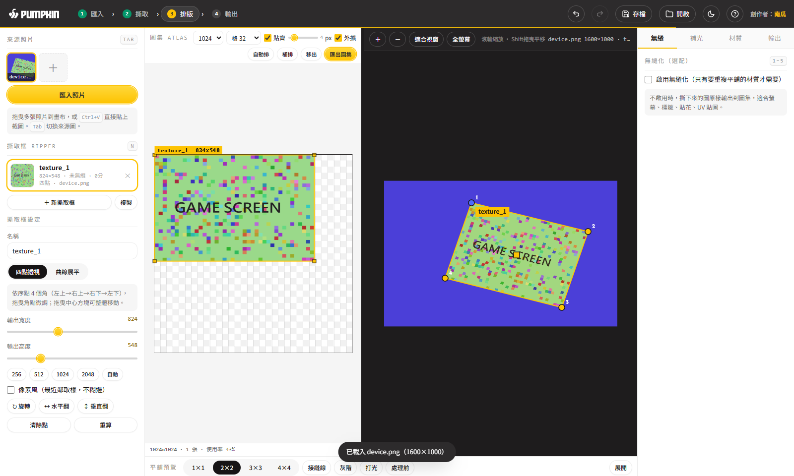
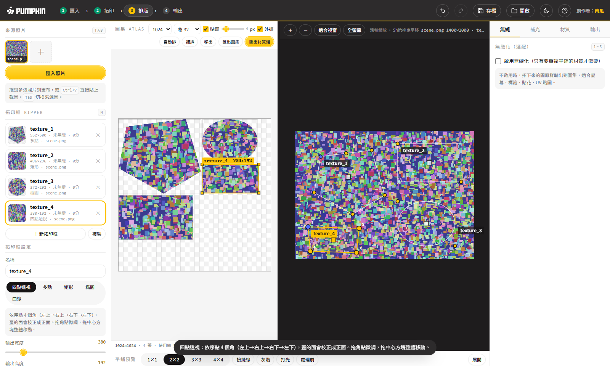
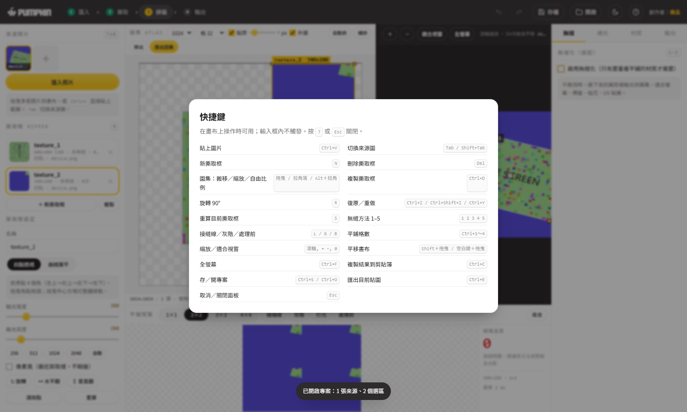

# 🎃 南瓜拓印 Pumpkin Imprint · pumpkin-texture-ripper

把照片裡歪的、斜的表面「**拓**」下來，變成正面的貼圖，直接排進圖集當 3D 模型的 UV 貼圖用；要平鋪材質再開無縫化；一鍵出整組 PBR（Albedo／Normal／Roughness／AO／Height）。純網頁單檔、離線可用、雙擊就開。舊名「紋理撕裂機」，2026-09-22 改名；資料夾名沿用。

▶️ **線上試用**：https://terry12260201.github.io/pumpkin-imprint/ （不用安裝，瀏覽器直接開）

## 它解決什麼問題

3D 美術做模型貼圖，常常手邊只有一張照片：機器的面板、遊戲機螢幕、瓶身標籤、牆面。照片有透視、有光影、還得自己排 UV。這工具把流程收進一個網頁：

1. **拓印**：點 4 個角（透視校正）、多點沿邊描、或直接拖矩形／橢圓框，圖立刻拓下來
2. **排版**：拓好的圖自動進左邊圖集，拖曳搬、拉角縮放、旋轉，自己排 UV
3. **匯出**：整張圖集的 Albedo／Normal／Roughness／AO／Height 五張＋UV JSON，照 Unity／Unreal／Blender 命名
4. **選配**：無縫化（四種算法、即時平鋪預覽、接縫分數）、去光影、材質預設組

## 怎麼用

雙擊 `index.html`。截圖後 `Ctrl+V` 貼進來，或拖照片進右邊畫布。

| 想做什麼 | 操作 |
|---|---|
| 歪的面拉正 | `Q` 四點透視：依序點左上→右上→右下→左下 |
| 不規則區域 | `P` 多點：沿邊逐點描，點回起點或 `Enter` 收合（外面透明） |
| 快速框一塊 | `M` 矩形 / `O` 橢圓：按住拖出範圍 |
| 瓶身、圓柱 | `C` 曲線：上緣 3 點＋下緣 3 點展平 |
| 排 UV | 左邊圖集：拖曳搬移、拉角縮放、`R` 旋轉、自動排／補排／移出 |
| 出圖 | 圖集工具列「匯出材質組」（5 張＋JSON）或「匯出圖集」（只顏色） |
| 平鋪材質 | 右欄「無縫」勾「啟用無縫化」，底欄平鋪預覽即時打分 |

`?` 看全部快捷鍵。要改功能就對 Claude 說「**開拓印工具**」「**修改南瓜拓印**」。

## 畫面

## 資料放哪

純前端，**沒有資料庫**，工具本體就是 `index.html`。維護細節見 `SKILL.md`，要交給別的 AI 接手看 `HANDOFF.md`。

- 開發副本：`<開發機>\pumpkin-texture-ripper\`（PC-02），測試截圖在 `_test_shots\`
- 三處同步：本機 `~/.claude/skills/pumpkin-texture-ripper/`｜Obsidian `_系統/skills/`｜GitHub 私有 `pumpkin-skills`
- 去敏乾淨（只有「創作者：南瓜」與公司 Logo），可以公開分享
