<picture>
  <source media="(prefers-color-scheme: dark)" srcset="docs/readme/banner-dark.svg">
  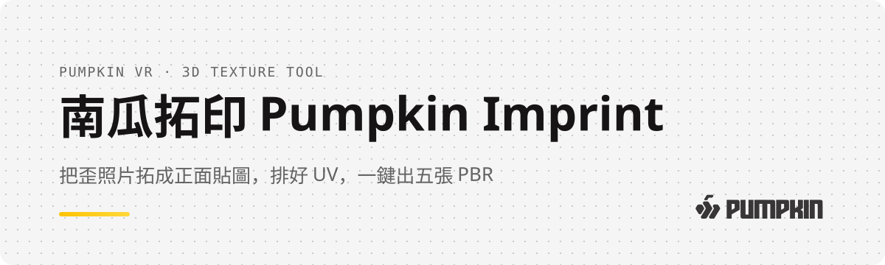
</picture>

<p align="center">
  <a href="https://terry12260201.github.io/pumpkin-imprint/"></a>
  
  
  
</p>

<p align="center">
  <a href="#-它在做什麼">它在做什麼</a> •
  <a href="#-四個步驟">四個步驟</a> •
  <a href="#-要平鋪的材質無縫化">無縫化</a> •
  <a href="#-快捷鍵">快捷鍵</a> •
  <a href="#-目前的限制">限制</a>
</p>

做 3D 模型貼圖時，手邊常常只有一張照片：機器面板、木箱、瓶身標籤、一面牆。照片裡的東西是歪的、有透視、有光影，還得自己排 UV。

南瓜拓印把這整段收進一個網頁：**點四個角把歪的面拉正，拓下來自動排進圖集，再一鍵匯出 Albedo、Normal、Roughness、AO、Height 五張貼圖**，照 Unity、Unreal、Blender 的命名規則存好。不用安裝，雙擊就開，斷網也能用。

<p align="center">
  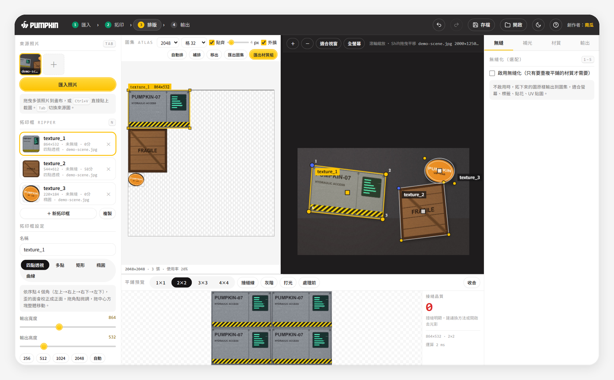
  <br><sub>▲ 右邊框照片、左邊排圖集、下面看平鋪效果。示範照片是程式產生的模擬圖</sub>
</p>

<h3 align="center"><a href="https://terry12260201.github.io/pumpkin-imprint/">🎃 立刻試用 →</a></h3>

<!-- 🎬 影片位：20–40 秒操作錄影（建議：Ctrl+V 貼截圖 → 點四角 → 圖集自動出現 → 匯出材質組）。
     上架方式：在 GitHub 網頁編輯這個 README，把 mp4 拖進編輯框（≤ 10MB），
     會產生 https://github.com/user-attachments/assets/… 網址，單獨放一行取代這段註解。 -->

---

## 📸 它在做什麼

「拓印」就像拿紙蓋在石碑上拓字：不管原本的表面怎麼斜，拓下來都是正的。

<table>
  <tr>
    <td align="center" width="50%">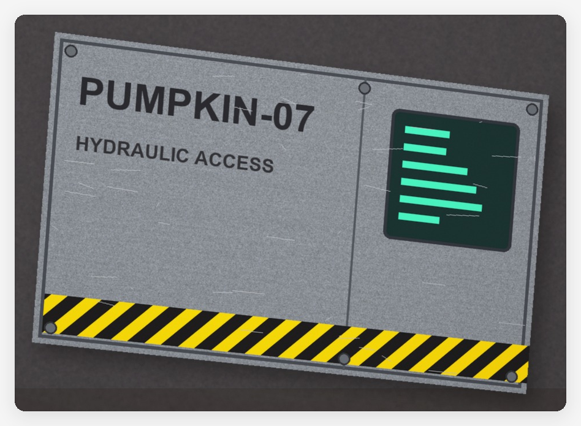<br><sub>拓印前：照片裡歪斜、有透視的面板</sub></td>
    <td align="center" width="50%">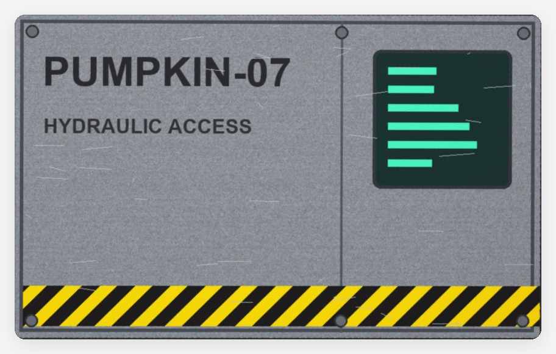<br><sub>拓印後：點四個角，拉成正面貼圖</sub></td>
  </tr>
</table>

拉正之後的圖會自動放進左邊的圖集。你可以拖曳、縮放、旋轉，自己排 UV。排好就能整組匯出，直接貼到 3D 模型上。

---

## 🧭 四個步驟

工具最上方有一條流程列，照著走就不會迷路：

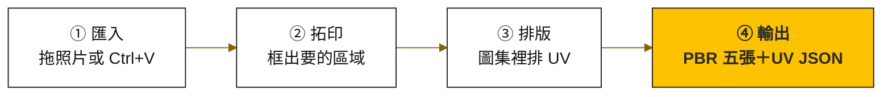

### ① 匯入

把照片拖進右邊畫布，或截圖後直接按 <kbd>Ctrl</kbd> + <kbd>V</kbd> 貼上。可以一次放好幾張，用 <kbd>Tab</kbd> 切換。

**做對的話**，照片會出現在右邊，左上角「來源照片」多一張縮圖。

### ② 拓印：五種框法

| 按鍵 | 模式 | 什麼時候用 |
|:---:|---|---|
| <kbd>Q</kbd> | **四點透視** | 歪的平面要拉正：依序點左上 → 右上 → 右下 → 左下 |
| <kbd>P</kbd> | 多點 | 不規則形狀：沿著邊一點一點描，點回起點或按 <kbd>Enter</kbd> 收合，框外變透明 |
| <kbd>M</kbd> | 矩形 | 已經是正面的東西，快速框一塊 |
| <kbd>O</kbd> | 橢圓 | 圓形貼紙、徽章、錶面 |
| <kbd>C</kbd> | 曲線展平 | 瓶身、圓柱：上緣點 3 點、下緣點 3 點，把弧面攤平 |

**做對的話**，框好的瞬間左邊圖集就會出現拉正後的圖，不用按任何按鈕。框完還能拖角點微調、整個移動、旋轉或翻轉。

> [!TIP]
> 截圖時盡量拍正面一點、光線平均一點，拓出來的貼圖細節會更完整。照片解析度越高，拓出來越清楚。

### ③ 排版

左邊圖集就是你的 UV 版面。拖曳搬移、拉角落縮放（會用新尺寸重新拓，不是單純放大）、按 <kbd>R</kbd> 轉 90°。兩張重疊時會標紅提醒，按「自動排」可以一鍵重排。

### ④ 輸出

按圖集上方的 **「匯出材質組」**，一次存下五張貼圖和一份記錄每張圖位置的 UV JSON：

<p align="center">
  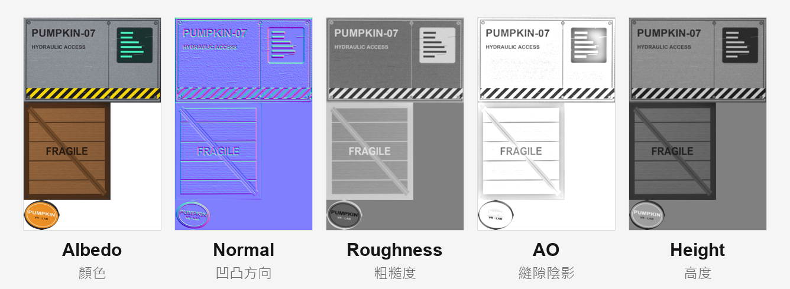
</p>

檔名會照你選的引擎自動命名，Normal 的 Y 軸方向也會跟著切換：

| 引擎 | 檔名範例 |
|---|---|
| 通用 | `name_albedo`、`name_normal`… |
| Unity | `_BaseColor`、`_Normal`、`_Roughness`、`_AO`、`_Height` |
| Unreal | `T_name_D`、`_N`、`_R`、`_AO`、`_H`（Normal 自動改 DirectX） |
| Blender | `_col`、`_nor`、`_rough`、`_ao`、`_disp` |

---

## 🧱 要平鋪的材質：無縫化

牆面、地板、布料這種要重複鋪滿的材質，邊緣接起來常常會看到明顯的接縫。在右欄勾 **「啟用無縫化」**，下方平鋪預覽會即時重算，還會幫你打分數。

<table>
  <tr>
    <td align="center" width="50%">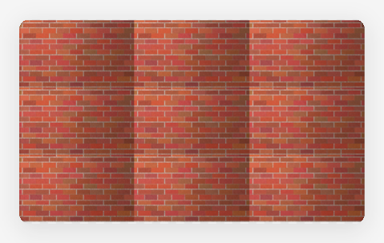<br><sub>處理前：接縫品質 <b>0</b> 分，每格交界都看得到</sub></td>
    <td align="center" width="50%">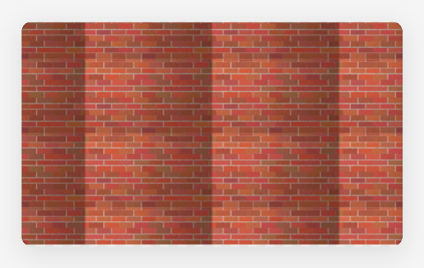<br><sub>無縫化後：<b>100</b> 分，接縫消失</sub></td>
  </tr>
</table>

四種算法，按 <kbd>1</kbd>–<kbd>5</kbd> 快速切換：

| 方法 | 適合 |
|---|---|
| 位移＋低頻補償 | 通用，保留最多細節（預設） |
| 頻率分離混合 | 金屬、布料、水泥 |
| 邊緣散佈貼片 | 石材、泥土、磚 |
| 鏡像拼接 | 保證無縫，但畫面會對稱 |

> [!NOTE]
> 無縫化**預設是關的**。拓機器面板、標籤這種「只貼一次」的貼圖不需要它，打開反而會改到原圖。

<details>
<summary><b>🖼️ 看無縫化時的完整畫面</b></summary>

<p align="center">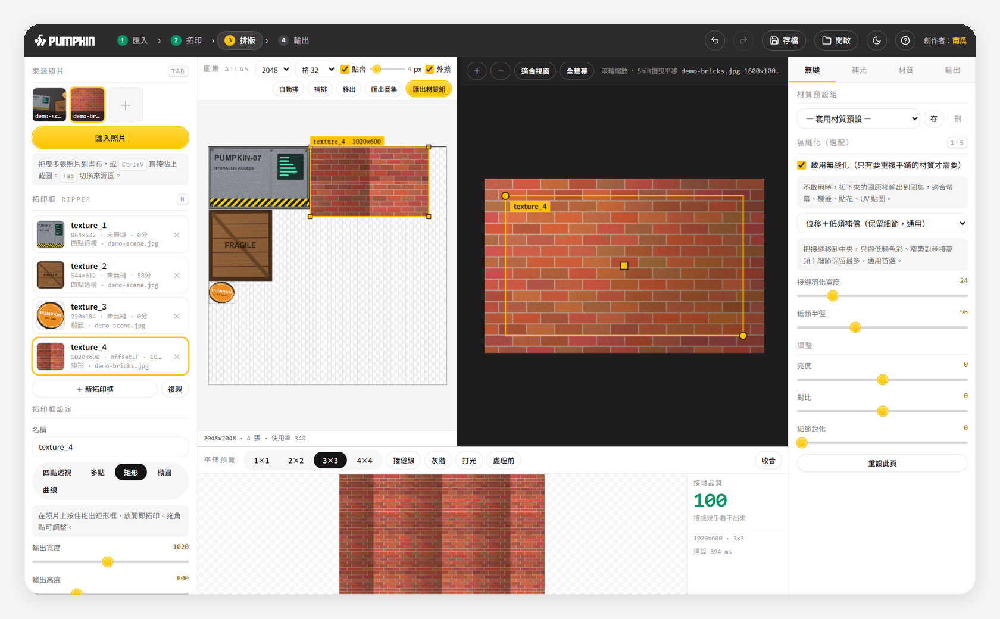</p>
</details>

---

## ✨ 其他好用的

| 功能 | 說明 |
|---|---|
| 🌙 日／夜模式 | 右上角月亮按鈕切換，長時間作業比較不刺眼 |
| 💾 專案存讀 | <kbd>Ctrl</kbd> + <kbd>S</kbd> 存成 JSON，下次打開所有框和圖集都還在 |
| ↩️ 復原／重做 | <kbd>Ctrl</kbd> + <kbd>Z</kbd>／<kbd>Ctrl</kbd> + <kbd>Y</kbd> |
| 🎨 材質預設組 | 常用參數存成預設，下次一鍵套用 |
| 🧱 像素風 | 拓印框勾「像素風」，用最近鄰取樣，不會糊掉 |
| 🌗 去光影 | 減弱照片裡不均勻的打光，讓貼圖在 3D 裡重新打光更自然 |

<p align="center">
  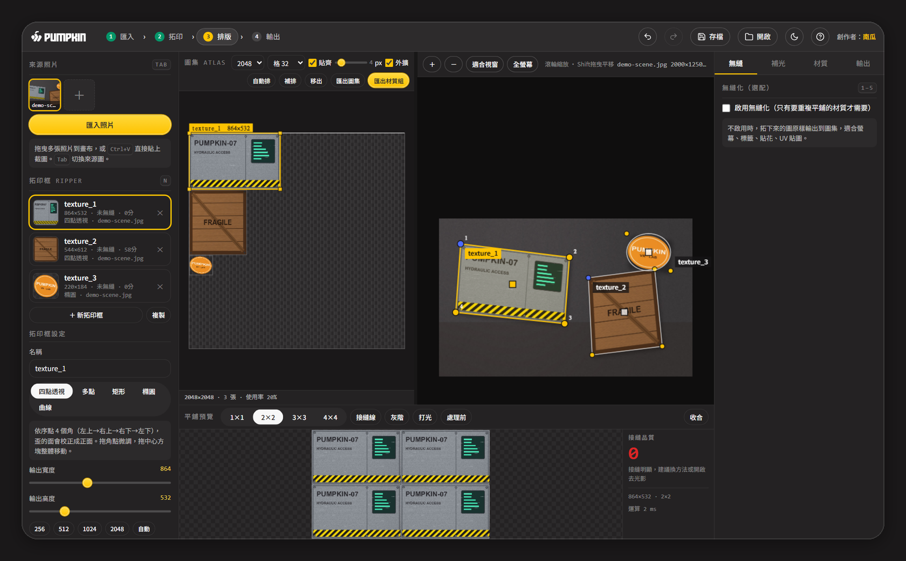
  <br><sub>▲ 夜間模式</sub>
</p>

---

## 🔤 快捷鍵

在工具裡按 <kbd>?</kbd> 就能叫出這張表：

<p align="center">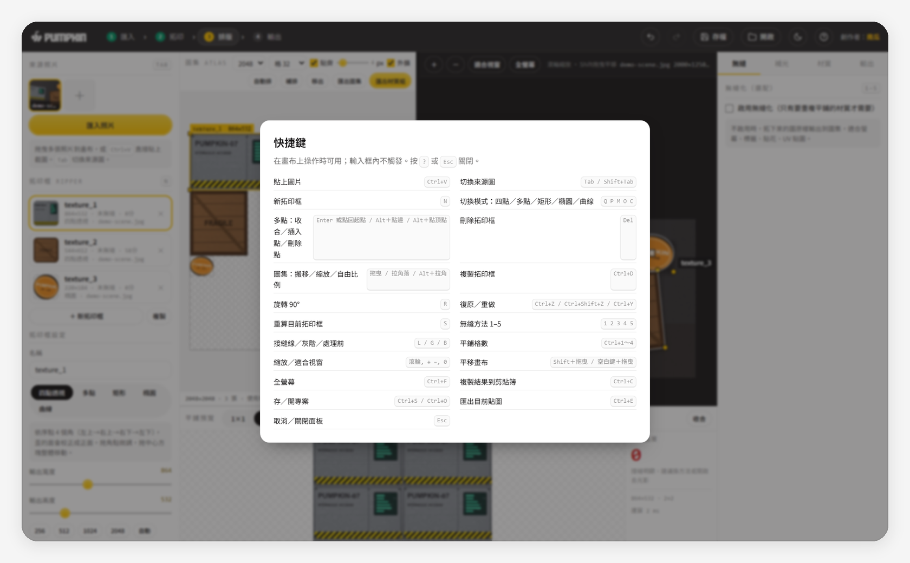</p>

<details>
<summary><b>📋 完整快捷鍵清單（文字版，方便搜尋）</b></summary>

| 按鍵 | 功能 |
|---|---|
| 滾輪／<kbd>+</kbd> <kbd>−</kbd>／<kbd>0</kbd> | 縮放／適合視窗 |
| <kbd>Shift</kbd>＋拖曳、空白鍵＋拖曳、中鍵 | 平移照片 |
| <kbd>Ctrl</kbd> + <kbd>F</kbd> | 全螢幕 |
| <kbd>Ctrl</kbd> + <kbd>V</kbd> | 貼上剪貼簿圖片 |
| <kbd>Tab</kbd>／<kbd>Shift</kbd> + <kbd>Tab</kbd> | 切換來源圖 |
| <kbd>N</kbd>／<kbd>Del</kbd>／<kbd>Ctrl</kbd> + <kbd>D</kbd>／<kbd>R</kbd> | 新拓印框／刪除／複製／旋轉 90° |
| <kbd>Q</kbd> <kbd>P</kbd> <kbd>M</kbd> <kbd>O</kbd> <kbd>C</kbd> | 四點／多點／矩形／橢圓／曲線 |
| <kbd>Enter</kbd>、點回起點／<kbd>Alt</kbd>＋點邊／<kbd>Alt</kbd>＋點頂點 | 多點：收合／插入點／刪除點 |
| 圖集：拖曳／拉角／<kbd>Alt</kbd>＋拉角 | 搬移／等比縮放／自由比例 |
| <kbd>S</kbd> | 重算目前拓印框 |
| <kbd>1</kbd>–<kbd>5</kbd> | 無縫方法：不處理／位移低頻／頻率分離／散佈貼片／鏡像 |
| <kbd>L</kbd>／<kbd>G</kbd>／<kbd>B</kbd> | 接縫線／灰階／處理前 |
| <kbd>Ctrl</kbd> + <kbd>1</kbd>–<kbd>4</kbd> | 平鋪格數 |
| <kbd>Ctrl</kbd> + <kbd>Z</kbd>／<kbd>Ctrl</kbd> + <kbd>Shift</kbd> + <kbd>Z</kbd>／<kbd>Ctrl</kbd> + <kbd>Y</kbd> | 復原／重做 |
| <kbd>Ctrl</kbd> + <kbd>S</kbd>／<kbd>Ctrl</kbd> + <kbd>O</kbd> | 存／開專案 JSON |
| <kbd>Ctrl</kbd> + <kbd>E</kbd>／<kbd>Ctrl</kbd> + <kbd>C</kbd> | 匯出目前貼圖／複製結果到剪貼簿 |
| <kbd>?</kbd>／<kbd>Esc</kbd> | 快捷鍵面板／關閉面板 |
</details>

---

## 🚧 目前的限制

老實說，這些還沒做到：

- **多點、矩形、橢圓只會裁切，不會拉正**。透視校正目前只支援四點；要「不規則形狀又要拉正」，先用四點拉正，再疊一個多點框去背。
- 圖集裡不能放大檢視，4096 的大圖集上，小張貼圖會看得比較吃力。
- 曲線展平不能和多點遮罩同時用。
- 沒辦法即時同步到 Blender 或 Unity（純網頁做不到），改用 PNG＋UV JSON 交接。
- 還沒有手機版和觸控操作。

---

## 🔧 自己用、自己改

整個工具就是一個 `index.html`，沒有任何外部套件、不連 CDN。

```bash
git clone https://github.com/terry12260201/pumpkin-imprint.git
```

**做對的話**，進資料夾雙擊 `index.html`，瀏覽器就會打開工具，斷網也能用。

<details>
<summary><b>🧩 技術細節</b></summary>

- **單檔架構**：HTML、CSS、JavaScript 全部寫在 `index.html`，依 state → history → worker → pipeline → io → stage → preview → pbr → atlas → export → ui 分區。
- **不卡畫面**：運算放在 Web Worker（寫在同一個檔案裡），2048×2048 的貼圖約 1.6 秒算完；瀏覽器不支援 Worker 時會自動改在主執行緒跑。
- **透視校正**：用四個角點解單應性矩陣（homography），再逐像素反向取樣。
- **測試**：`tests/` 裡有 Playwright 腳本，會實際開頁面跑完拓印、排版、匯出流程。
- 接手開發請看 [docs/HANDOFF.md](docs/HANDOFF.md)，功能對照與維護指南在 [docs/DEVELOPMENT.md](docs/DEVELOPMENT.md)。
</details>

### 名詞對照表

| 名詞 | 白話 |
|---|---|
| UV | 3D 模型「攤平」後的展開圖，決定貼圖的哪一塊貼在模型哪裡 |
| 圖集（Atlas） | 把很多小貼圖排在同一張大圖上，省記憶體也好管理 |
| PBR | 用好幾張貼圖描述材質（顏色、凹凸、粗糙、陰影、高度），讓 3D 打光看起來真實 |
| 透視校正 | 把斜著拍的平面，算回正對著看的樣子 |
| 無縫（Seamless） | 貼圖左右上下接起來看不出邊界，可以無限重複鋪 |
| 法線 Y 軸（OpenGL／DirectX） | Normal 貼圖的綠色通道方向，兩種引擎規則相反，用錯凹凸會反過來 |

## 致謝

靈感與功能對照來自 [Puck's Texture Ripper](https://puszke.itch.io/pucks-texture-ripper) 和 [EkstrakTex](https://bagusindrayana.itch.io/ekstraktex)。

## 授權

目前未指定授權。

<sub>— 南瓜｜南瓜虛擬科技 · XR／3D／AI 工作流 · 最後更新 2026-10-04</sub>
