# 南瓜拓印 Pumpkin Imprint · 夥伴上手教學（v2.3）

> 給第一次用的同事。照著做 5 分鐘就能把照片拓成貼圖、排進圖集、匯出到引擎。
> 截圖全部用工具內建的「範例圖」（程序化畫的機器面板＋油桶），你按「載入範例」就能跟著練。

工具在哪：雙擊 `index.html`（Chrome／Edge 都可，離線也能用）。

---

## 1. 第一次打開：跟著 4 步導覽走

第一次開會自動跳出「新手導覽」，亮起來的地方就是現在要看的區塊。

- **下一步**：往下走。
- **略過**：這次先不看；下次再打開工具（新的分頁或視窗）還會出現。同一個分頁按 F5 重新整理不會再跳。
- **不再顯示**：以後不自動出現。想再看，按頂欄「**教學**」就能重開。

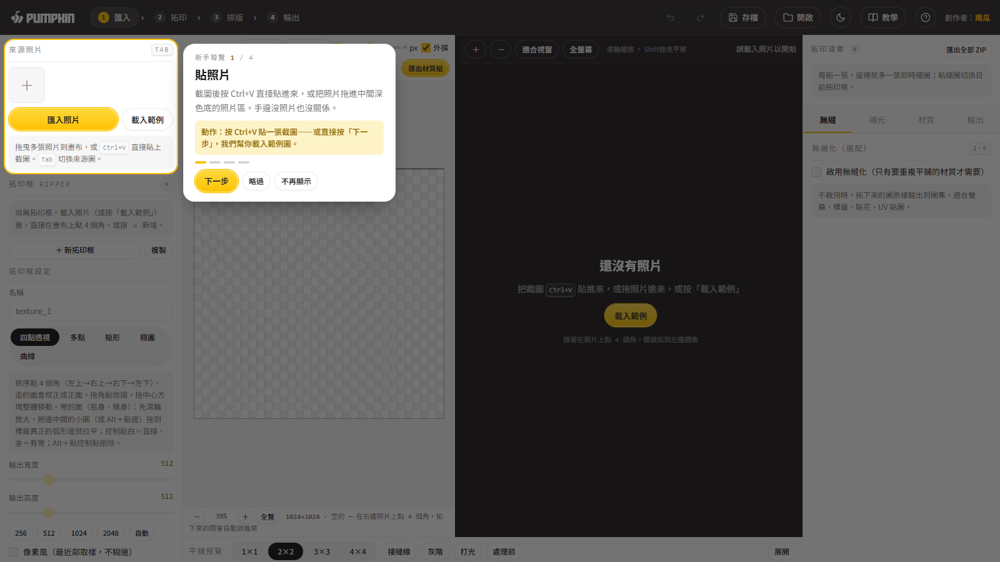

## 2. 放照片進來（沒照片就用範例）

畫布沒圖時，中間會告訴你三種方法：

1. 截圖後按 `Ctrl+V` 直接貼上。
2. 把照片拖進**中間深色底的照片區**（可以一次多張，`Tab` 切換；最右邊那欄是設定，不是放照片的地方）。
3. 按金色「**載入範例**」——內建一張斜拍的機器面板＋油桶標籤，專門給你練習。

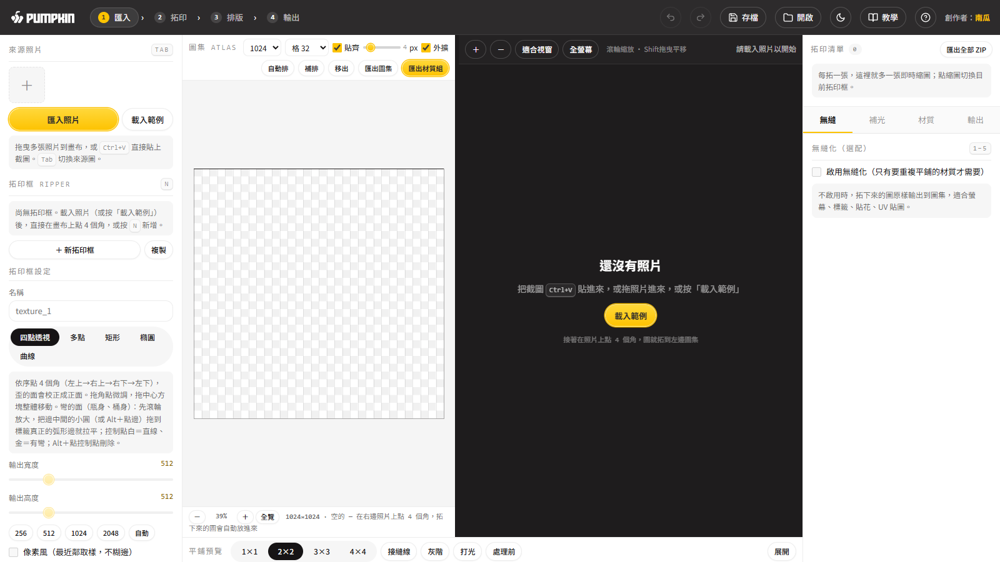

## 3. 點 4 個角，斜的面立刻拉正

照片裡的東西如果很小，先把滑鼠移到它上面、**滾輪放大**到它差不多佔滿照片區，點起來才準。

在照片上依序點 **左上 → 右上 → 右下 → 左下**。點完第 4 點，圖就拓成正面，自動放進左邊「**圖集**」（圖集＝很多張小貼圖排在同一張大圖上；模型靠 **UV** 座標知道自己用大圖的哪一塊。不懂的詞按 `?` 看「名詞表」），右上「拓印清單」也多一張縮圖。

導覽第 2 步會自動幫你點好範例面板的 4 個角，讓你先看一次效果：

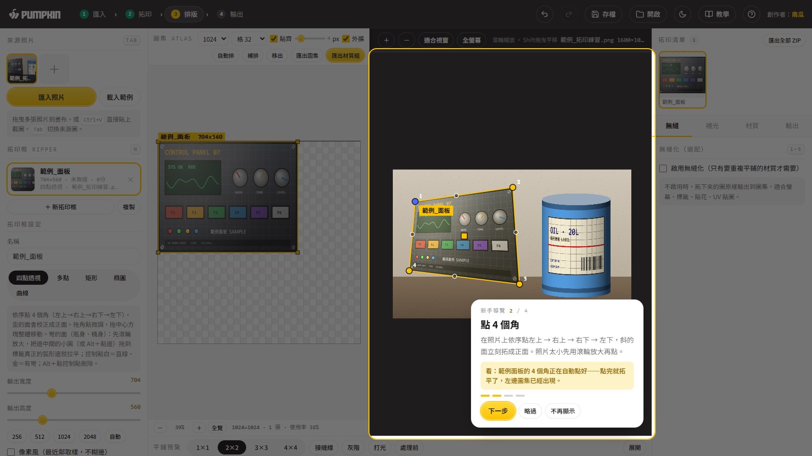

點歪了沒關係：

- 拖角點微調，結果即時更新（拖的時候先用 ¼ 解析度預覽，放開才算全解析度，所以很順）。
- 拖中間的小方塊可以整個框一起搬。
- `Ctrl+Z` 隨時復原。

**拓第 2 張**：在照片的空白處再點 4 個角，工具會自動開一個新框（也可以先按 `N`）。每張拓好的圖都會排進圖集。

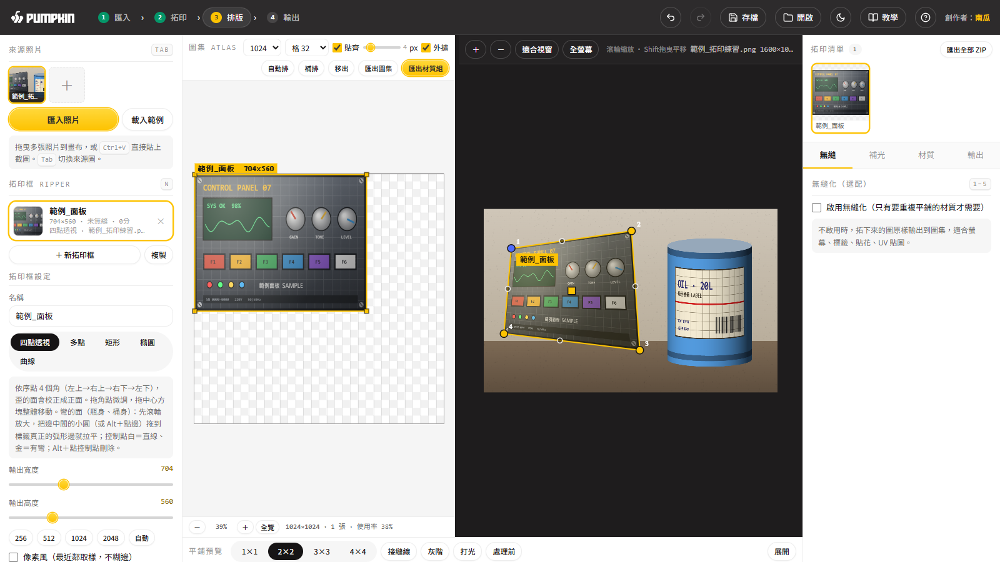

## 4. 彎的東西（瓶身、桶身標籤）：把邊拉成弧線

一般四點框的邊是直的，拿來拓油桶標籤，中間那條紅線會是彎的：

做法：

1. **先用滾輪把桶子放大**到佔滿照片區（物件太小時弧度只有幾個像素，很難拉準）。
2. 照常點標籤的 4 個角。
3. 框被選取時，每條邊中間有一顆**小圓點**。按住上邊的小圓，**拖到照片上標籤真正的邊緣**，讓金色框線貼著標籤的弧形邊（桶子是從上面往下看，所以上邊通常要往**下**拖）。下邊一樣，拖到標籤底部的弧形邊。也可以 `Alt`＋點邊上任何位置加控制點。
4. 看控制點顏色：**金色＝這條邊有彎**；**白色＝目前是直線**（把彎的點拖回直線附近，它會自動吸回直線、變白）。
5. 上下兩條邊都貼好，標籤就攤平了：紅線變直、格線變方。
6. 每條邊最多 2 個控制點（2 個可以貼更複雜的弧）。`Alt`＋點控制點可刪除。

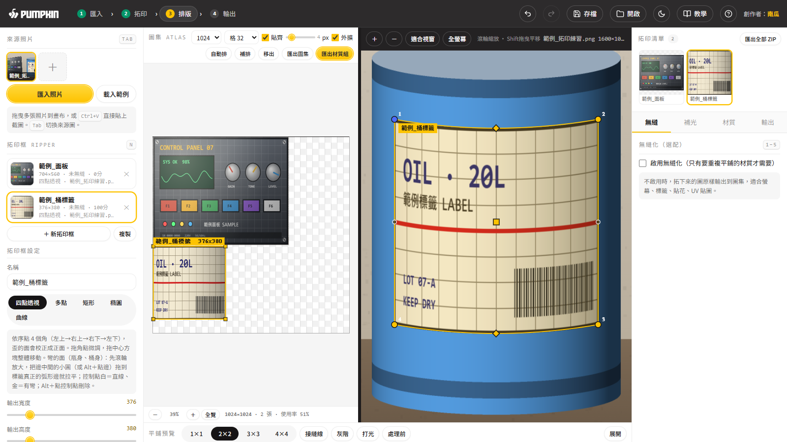

> 拉完之後看左邊圖集：紅線是直的，就代表標籤攤平了。

## 5. 排圖集（UV）

拓好的圖都在左邊圖集裡：

| 想做什麼 | 怎麼做 |
|---|---|
| 搬位置 | 直接拖曳（預設貼齊格線） |
| 改大小 | 先在**圖集裡**點一下那張圖，外框四個角會出現**金色小方塊**，拉它就能縮放（鎖比例；`Alt`＋拉＝自由比例）。放開會用新尺寸**重新拓**，不會越拉越糊。注意是拉圖集裡的方塊，不是照片上的角點 |
| 旋轉 | `R` |
| 放大看細節 | 滾輪縮放；`Shift`＋拖曳或中鍵平移；`Home` 回全覽；底部也有 －／＋／全覽 |
| 一次排好 | 「自動排」 |

紅框＝重疊或超出圖集，匯出前清掉。

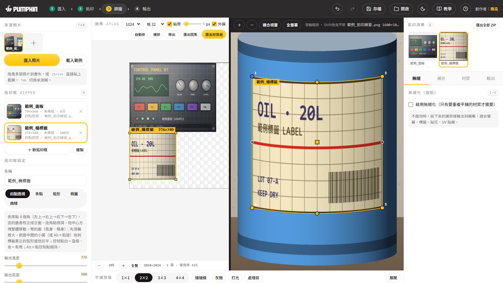

## 6. （選配）要重複平鋪的材質才做無縫

螢幕、標籤、貼花這類「只貼一次」的不用做。要做地板、牆面這種重複平鋪的材質：

1. 右欄「無縫」分頁勾「**啟用無縫化**」，底下會出現平鋪預覽和接縫分數。
2. 混合後接縫處的紋理會變糊，拉「**細節回復**」把原圖的細節補回來。
3. 「**對比（局部）**」讓紋理更立體（負值會變平）；下面的「整體對比」是整張亮暗。

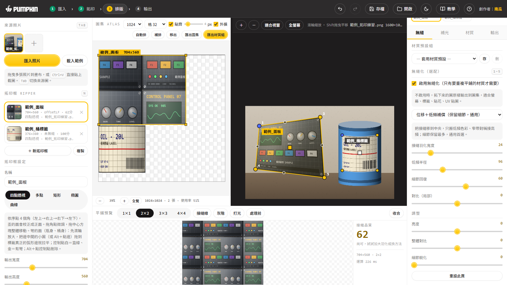

## 7. 做到一半：記得存檔

工具不會自動暫存，**重新整理或關掉分頁，內容就不見了**。

- 按頂欄「**存檔**」（`Ctrl+S`）：下載一個專案檔（.json，照片和所有框都在裡面）。
- 下次按頂欄「**開啟**」（`Ctrl+O`）選那個檔，就能接著做。

## 8. 匯出到引擎

打開最右欄的「**輸出**」分頁，在「目標引擎」下拉選單選你用的引擎（Unity／Unreal／Blender），檔名和法線方向會自動對好。

- **圖集材質組**（金色）：整張圖集的 Albedo／Normal／Roughness／AO／Height 五張＋UV JSON。
- **匯出全部拓印（ZIP）**：每張拓印一個 PNG，打包成一個 ZIP，檔名＝`來源檔名_拓印名.png`。右上拓印清單的「匯出全部 ZIP」是同一個功能。
- 單張：「匯出貼圖 PNG」或 `Ctrl+E`。

匯進引擎後要做的一兩個動作：

| 引擎 | 照著做 |
|---|---|
| Unity | 在 Project 視窗點 `_Normal` 那張 → 右邊 Inspector 的 **Texture Type** 改成 **Normal map** → 按 **Apply** |
| Unreal | 在內容瀏覽器雙擊 `_R`（粗糙度）和 `_AO` 貼圖 → 把 **sRGB** 勾掉 → 存檔。法線貼圖不用動：工具匯出時已經是 Unreal 用的 DirectX 方向 |
| Blender | 選 `_nor` 的 Image Texture 節點 → **Color Space** 選 **Non-Color** → 接到 **Normal Map** 節點再接進材質的 Normal |

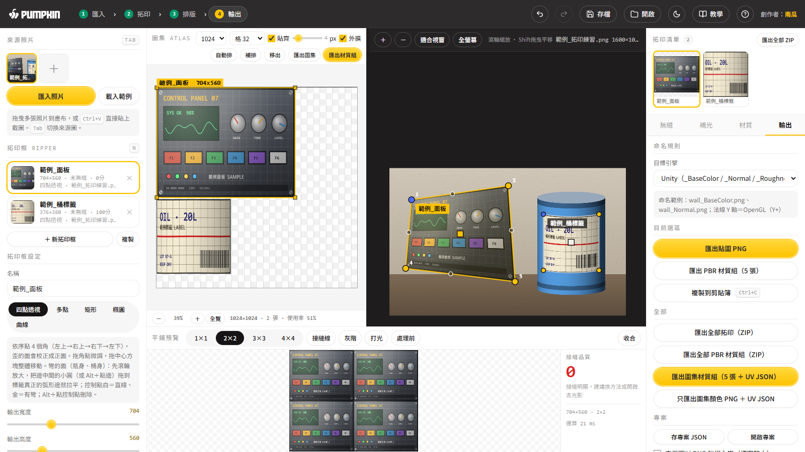

## 9. 忘了怎麼用？按 `?`

右上「?」（或鍵盤 `?`）打開教學面板，六個分頁：30 秒上手、五種框法何時用、排 UV 訣竅、匯出到 Unity／Unreal／Blender、名詞表、快捷鍵。手機寬也看得清楚。

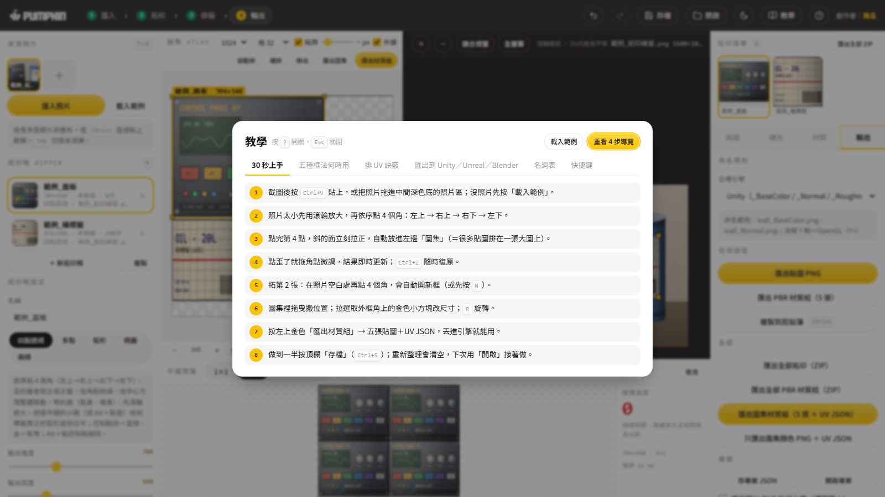

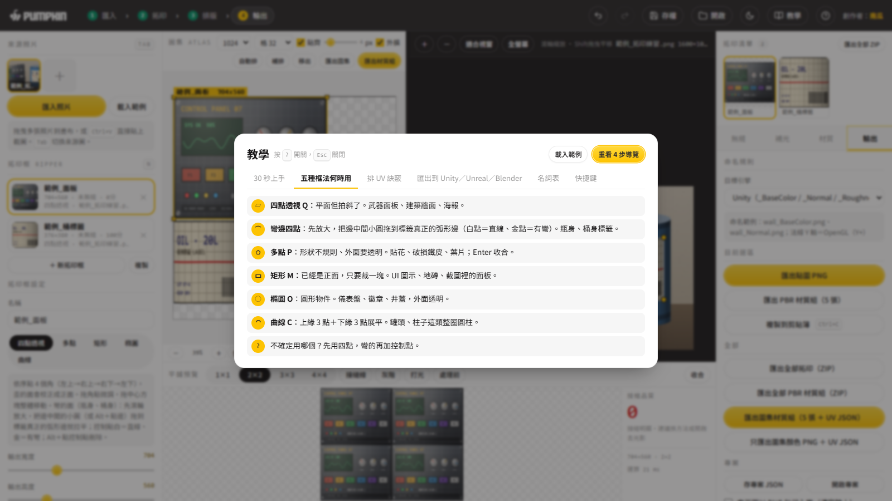

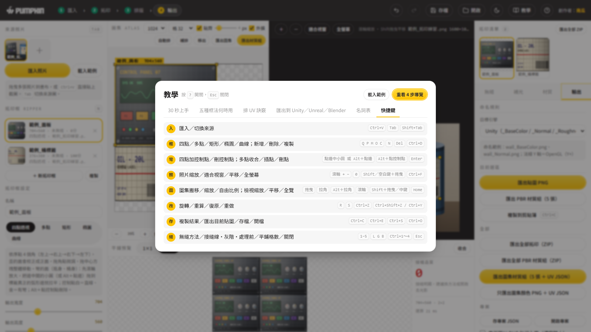

---

### 常見情境（GG 美術）

- **武器側面板拍斜了**：四點拉正 → 圖集裡拉大（看得到的面給多一點像素）→ 匯出材質組。
- **建築牆面**：四點拉正 → 右欄勾無縫化、細節回復 40～60 → 平鋪預覽看接縫 → 匯出。
- **瓶身／油桶標籤**：四點＋上下邊各拉一個控制點 → 單張匯出 → 貼到瓶子模型 UV。
- **不規則貼花、破鐵皮**：多點 `P` 沿邊描，`Enter` 收合，外面自動透明。

創作者：南瓜
